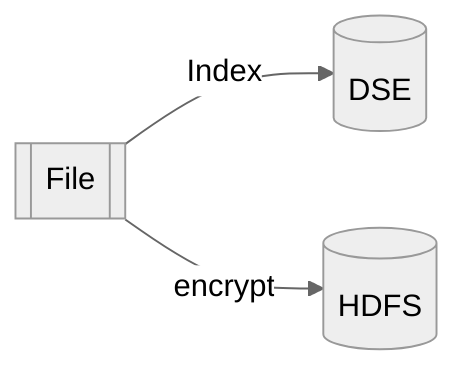
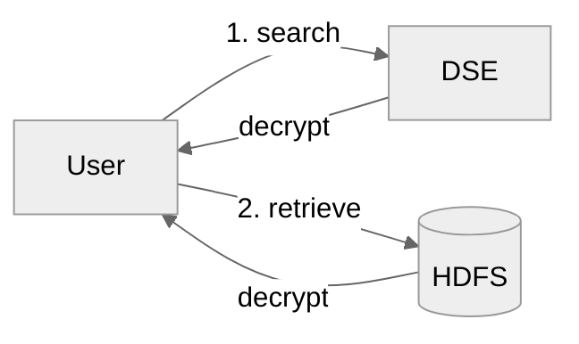

# BNPP-Cosmian
## Key Policy Attribute Based Encryption (KP-ABE) and Symmetric Searchable Encryption (SSE)

Encryption of transactions to HDFS using a public key and access policy attributes.
Decryption of authorised transaction from HDFS using a private key with access policies.


  - [Key Policy Attribute Based Encryption (KP-ABE) and Symmetric Searchable Encryption (SSE)](#key-policy-attribute-based-encryption-kp-abe-and-symmetric-searchable-encryption-sse)
    - [Flow Overview](#flow-overview)
      - [Indexing using Symmetric Searchable Encryption](#indexing-using-symmetric-searchable-encryption)
      - [Attributes Based Encryption](#attributes-based-encryption)
    - [Policy](#policy)
    - [Policy Attributes](#policy-attributes)
    - [User Keys](#user-keys)
  - [Software](#software)
    - [Example Usage](#example-usage)
      - [Encrypting](#encrypting)
      - [Searching](#searching)
      - [Direct Decryption](#direct-decryption)
    - [Building](#building)
    - [CoverCrypt](#cover-crypt)
    - [cosmian_java_lib](#cosmian_java_lib)
    - [main program: bnpp_cosmian](#main-program-bnpp_cosmian)
  - [Setting up a test hadoop environment](#setting-up-a-test-hadoop-environment)
    - [Listing Hadoop files](#listing-hadoop-files)
  - [Setting up Cassandra DSE](#setting-up-cassandra-dse)
    - [Running locally](#running-locally)


### Flow Overview

##### Upserting

Encrypted indexing and insertion of encrypted data with attributes into HDFS are performed at the same time.



##### Searching

The user sends an encrypted query to the encrypted index; the user recovers the transactions UIDs from the encrypted response; the encrypted transactions are retrieved from the HDFS repository then decrypted by the user, when its decryption key allows.




#### input/output file

The clear text files used as input and output are clear text lines of transactions in a proprietary JSON format.

```text
{"payload":{"paymentFlowChainReferences":{"exc...
{"payload":{"paymentFlowChainReferences":{"exc...
{"payload":{"paymentFlowChainReferences":{"exc...
...
{"payload":{"paymentFlowChainReferences":{"exc...
{"payload":{"paymentFlowChainReferences":{"exc...

```

#### Indexing using Findex 

First, get direction value from `payload.businessPaymentInformation.pmtBizCntxt.drctn.ITRId`, can be `IN` or `OUT`

- **country**: extract first 2 characters from IBAN, depending on direction, at
    - `IN` : `payload.businessPaymentInformation.cdtr.cdtrAcct`
    - `OUT`: `payload.businessPaymentInformation.dbtr.dbtrAcct`
- **CSM**: extract value from  `payload.businessPaymentInformation.clrNtwk`
- **BIC**: extract depending on direction from 
    - `IN` : `payload.businessPaymentInformation.cdtr.cdtrAgt`
    - `OUT`: `payload.businessPaymentInformation.dbtr.dbtrAgt`
- **party**: the BIC business party: this first 4 characters of the BIC


Values are prefixed by the index name i.e. `country=FR` and the search is made case insensitive.

Values are store in a DSE Cassandra database 5.1.20. 
Everything is encrypted in the DB.

#### Attributes Encryption using CoverCrypt

 - Enc: encryption with an ABE public key and policy attributes determined from the content of the transaction.
  Each transaction/line is considered unique and becomes a file in HDFS with name `Base58(SHA-256(content))`
 - Dec: decryption with an user private key of authorised transactions collected in a clear text file. The access policy of the key determines which transactions can be decrypted.

### Policy

Two non hierarchical axes:

- `Entity`: `{ BCEF, BNPPF, BNL, BGL, CIB, Other }`
- `Region`: `{ France, Monaco, Guyane, Martinique, La Réunion, Guadeloupe, Belgium, Italy, Luxembourg, Other }`

### Policy Attributes

Policy attributes are determined based on the BIC:

- BNPAFR : BCEF (France)
- BNPAMC : BCEF (Monaco)
- BNPAGU : BCEF (Guyane)
- BNPAMQ : BCEF (Martinique)
- BNPARE : BCEF (La Réunion)
- BNPAGP : BCEF (Guadeloupe)
- FPELFR (Financière de Paiements Electroniques ou NICKEL) : BCEF (France)
- GEBABE : BNPPF (Belgium)
- BNLIIT : BNL (Italy)
- BGLLLU : BGL (Luxembourg)
- BNPAxx : with xx not in FR, MC, RE, GU, MQ, GP : CIB (Other)
- anything else: Other (Other)


### User Keys

User Decryption Keys with various access policies have been generated using `--generate-keys` subcommand

```sh
java -jar target/bnpp-cosmian-3.0.0.jar --generate-keys -o src/test/resources/keys
```

Key                          | Access Policy
-----------------------------|---------------------------------------------------------
user_ALL_ALL_key.json        | `Entity::* & Country::*`  *<- super user*
user_BCEF_ALL_key.json       | `Entity::BCEF & Region::*`
user_BCEF_France_key.json    | `Entity::BCEF & Region::France`
user_BGL_Luxembourg_key.json | `Entity::BGL & Region::Luxembourg`
user_BNL_Italy.json          | `Entity::BNL & Region::Italy`
user_BNPPF_Belgium_key.json  | `Entity::BNPPF & Region::Belgium`
user_CIB_key.json            | `Entity::CIB & Region::Other`
user_Other_key.json          | `Entity::Other & Region::Other`


Access policies can be any boolean expression of the form:
```
(Entity::BCEF | Entity::BNL) & (Region::France | Region::Italy)`
```

When policy attributes of a transaction make the expression `true`, the transaction can be decrypted.

## Software

Java standalone and Spark program that performs injection with encrypted indexing to Cassandra and encryption to HDFS and extraction with decryption from HDFS.

Fot instructions on how to build the software, see the build section at the end.

Four sub-commands:
 - `--encrypt`: encryption and injection
 - `--search` : search words, extract and decrypt
 - `--decrypt`: extraction and decryption
 - `--generate-keys`: generate the keys above (requires KMS)

#### Standalone version

```
❯ java -jar target/bnpp-cosmian-3.0.0.jar
Jun 08, 2022 9:06:44 AM com.cosmian.bnpp.App main
INFO: Stating standalone app with args: []
usage: usage: app SUB-COMMAND [OPTIONS] [SOURCE URI] [WORD1, WORD2,...]
 -c,--clear-text-filename <arg>   the name of the clear text file when
                                  running decryption. Defaults to
                                  clear.txt
 -d,--decrypt                     decrypt the supplied files and
                                  directories URI(s)
 -dc,--dse-datacenter <arg>       the datacenter of the DSE server.
                                  Defaults to NULL or dc1 if the IP is
                                  127.0.0.1
 -di,--dse-ip <arg>               the IP address of the DSE server.
                                  Defaults to 127.0.0.1
 -dk,--dse-keyspace <arg>         the keyspace to use for the tables.
                                  Defaults to cosmian_sse
 -dp,--dse-port <arg>             the port of the DSE server. Defaults to
                                  9042
 -du,--dse-username <arg>         the username to connect to the DSE
                                  server. Defaults to NULL
 -dup,--dse-password <arg>        the password to connect to the DSE
                                  server. Defaults to NULL
 -e,--encrypt                     encrypt the supplied files and
                                  directories URI(s)
 -g,--generate-keys               generate all the keys
 -k,--key <arg>                   the path to the key file: defaults to
                                  key.json
 -o,--output-dir <arg>            the path of the output directory.
                                  Defaults to '.' for the filesystem,
                                  /user/${user} for HDFS
 -or,--disjunction                run a disjunction (OR) between the
                                  search words. Defaults to conjunction
                                  (AND)
 -s,--search                      search the supplied root URI for the
                                  words
```

#### Spark version

Please set `SPARK_HOME` to your `spark-2.4.8-bin-hadoop2.7` folder then run

```sh
./spark-run.sh [SUB-COMMAND] [OPTIONS]
```

The `[SUB-COMMAND]` and `[OPTIONS]` are identical to those of the standalone version.

### Example Usage

This shows examples using the Hadoop test environment set-up below

Replace the `hdfs:` scheme with `hdfso:` in the URIs below if you wish to use 
the HDFS connector without kerberos authentication (for example when using the 2.7.5 hadoop docker below)

To use the spark version, simply replace `java -jar target/bnpp-cosmian-3.0.0.jar` with `./spark-run.sh` in any example below

#### Encrypting

Encrypt 1408 records read from `.src/test/resources/pesddcosmian.txt` and write the 100 files to HDFS at `"hdfs://root@localhost:9000/user/root/"`

-  standalone

    ```bash
    java -jar target/bnpp-cosmian-3.0.0.jar --encrypt \
        -k src/test/resources/keys/public_key.json \
        -o "hdfs://root@localhost:9000/user/root/" \
        src/test/resources/pesddcosmian.txt
    ```

- spark

    ```bash
    ./spark-run.sh --encrypt \                   
        -k src/test/resources/keys/public_key.json \      
        -o "hdfs://root@localhost:9000/user/root/" \
        src/test/resources/pesddcosmian.txt 
    ```

#### Searching

There are 1405 records (out of 1408) for 'country=FR'....

- standalone

    ```sh
    time java -jar target/bnpp-cosmian-3.0.0.jar --search\
        -k src/test/resources/keys/user_ALL_ALL_key.json \
        -o src/test/resources/dec/ \
        -c search_FR_ALL.txt \
        "hdfs://root@localhost:9000/user/root/" \
        "country=FR"
    ```

- spark

    ```sh
    time ./spark-run-local.sh --search\
        -k src/test/resources/keys/user_ALL_ALL_key.json \
        -o src/test/resources/dec/ \
        -c search_FR_ALL.txt \
        "hdfs://root@localhost:9000/user/root/" \
        "country=FR"
    ```

There are 2 records with `country=DE`

```sh
time java -jar target/bnpp-cosmian-3.0.0.jar --search\
    -k src/test/resources/keys/user_ALL_ALL_key.json \
    -o src/test/resources/dec/ \
    -c search_DE_ALL.txt \
    "hdfs://root@localhost:9000/user/root/" \
    "country=DE"
```

> INFO: Found 2 records and decrypted 2 in 3,554ms (init: 6.3%, sse: 81.7%, hybrid decryption: 11.9%)


...which cannot be decrypted with the BNL Italy key

```sh
time java -jar target/bnpp-cosmian-3.0.0.jar --search\
    -k src/test/resources/keys/user_BNL_Italy_key.json \
    -o src/test/resources/dec/ \
    -c search_DE_ALL.txt \
    "hdfs://root@localhost:9000/user/root/" \
    "country=DE"
```


> INFO: Found 2 records and decrypted 0 in 3,601ms (init: 7.0%, sse: 81.5%, hybrid decryption: 11.4%)


The search defaults to conjunction (AND)

```sh
time java -jar target/bnpp-cosmian-3.0.0.jar --search\
    -k src/test/resources/keys/user_ALL_ALL_key.json \
    -o src/test/resources/dec/ \
    -c search_DE_SOLA.txt \
    "hdfs://root@localhost:9000/user/root/" \
    "country=DE" "party=SOLA"
```

> INFO: Found 2 records and decrypted 2 in 3,518ms (init: 6.3%, sse: 81.9%, hybrid decryption: 11.6%)

... and this search does not return any result

```sh
time java -jar target/bnpp-cosmian-3.0.0.jar --search\
    -k src/test/resources/keys/user_ALL_ALL_key.json \
    -o src/test/resources/dec/ \
    -c search_DE_NL.txt \
    "hdfs://root@localhost:9000/user/root/" \
    "country=DE" "country=NL"
```

> INFO: Found 0 records and decrypted 0 in 3,117ms (init: 6.9%, sse: 93.1%, hybrid decryption: 0.0%)


... however one can switch to disjunction (OR) using `--or`

```sh
time java -jar target/bnpp-cosmian-3.0.0.jar --search --or\
    -k src/test/resources/keys/user_ALL_ALL_key.json \
    -o src/test/resources/dec/ \
    -c search_DE_NL.txt \
    "hdfs://root@localhost:9000/user/root/" \
    "country=DE" "country=NL"
```

> INFO: Found 3 records and decrypted 3 in 3,560ms (init: 6.3%, sse: 82.1%, hybrid decryption: 11.4%)

### Building

First, clone this directory locally. A working version of the Java 8 compiler must be available.

The software is linked to 2 separate open-source libraries made by Cosmian. For maximum security and compatibility, these librairies should be built on the target system.

 - [CoverCrypt](https://github.com/Cosmian/cover_crypt): a native library developed in Rust that implements the CoverCrypt hybrid cryptography algorithm.

 - [cosmian_java_lib](https://github.com/Cosmian/cosmian_java_lib): the main Cosmian Java Library that exposes the Cosmian APIs and calls the ABE native library


### CoverCrypt

A pre-built linux version of the CoverCrypt library is already available in the `src/main/resources/linux-x86-64` folder. However:

 - this version is built against GLIBC 2.17 which may not be compatible with your system
 - this library is holding the cryptographic primitives: from a security standpoint, you should not trust the binary and build yourself from sources.

 Check the [CoverCrypt Github](https://github.com/Cosmian/cover_crypt) repository for documentation and build instructions.

### cosmian_java_lib

The cosmian java lib is available on Maven Central and does not need to be build to run this project.
If for security reasons, you still wish to do so,follow the steps below:

1. Clone the cosmian_java_lib repository:
    ```
    git clone https://github.com/Cosmian/cosmian_java_lib.git
    ```

2. Checkout the version v0.7.5
    ```
    git checkout v0.7.5
    ```
3. In the root directory of the cosmian_java_lib project, build the jar:
    ```
    mvn package -Dmaven.test.skip
    ```
4. Deploy the jar in the local Maven repository

    ```
    mvn install -Dmaven.test.skip
    ```

### main program: bnpp_cosmian

1. Compile and package the program. From the root directory

    ```
    mvn clean package -Dmaven.test.skip
    ```

2. Pull the dependencies locally in `target/dependency` directory

    ```
    mvn dependency:copy-dependencies
    ```

3. Print the help to check everything is fine

    ```
    java -jar target/bnpp-cosmian-3.0.0.jar
    ```


## Setting a test environment

### Setting up a test hadoop

This uses a docker version of hadoop 2.7.5 and makes it available to the `root` user at:

 - root fs: `hdfs://root@localhost:9000/user/root`
 - admin console: http://localhost:8088

1. Create a `hadoop-2.7.5` directory and the following sub-directories

```bash
mkdir shared
mkdir logs
mkdir input
```

2. Start hadoop running the following command in th `hadoop-2.7.5` directory

```bash
docker run --name hadoop-2.7.5 \
-v $(pwd)/shared:/usr/local/hadoop/shared \
-v $(pwd)/logs:/usr/local/hadoop/logs \
-v hadoop-2.7.5-data:/usr/local/hadoop/data \
-v $(pwd)/input:/usr/local/hadoop/input \
-p 8088:8088 \
-p 8042:8042 \
-p 9000:9000 \
--rm \
zejnils/hadoop-docker
```

3. To stop hadoop, run

```bash
docker stop hadoop-2.7.5
```

#### Listing Hadoop files

Run the command inside the docker container:

```bash
sudo docker exec hadoop-2.7.5 /bin/bash -c "/usr/local/hadoop-2.7.5/bin/hadoop fs -ls"
```

... to count them ....
```bash
sudo docker exec hadoop-2.7.5 /bin/bash -c "/usr/local/hadoop-2.7.5/bin/hadoop fs -count ."
```

### Setting up Cassandra DSE

- version 5.1.20:  `docker pull datastax/dse-server:5.1.20`
- driver: https://docs.datastax.com/en/developer/java-driver/4.13/

#### Running locally

```bash
sudo docker run -e DS_LICENSE=accept --network host --name dse_5.1.20 -d datastax/dse-server:5.1.20
```

### Installing Spark-2.4.8 Hadoop 2.7

Download [spark-2.4.8-hadoop-2.7](https://archive.apache.org/dist/spark/spark-2.4.8/spark-2.4.8-bin-hadoop2.7.tgz) 
and unzip to a directory. Set the environment variable `SPARK_HOME` to this directory path.

## Deploying via zip

Clean up the target folder, re-build then zip without .git files

```sh
rm -rf target
mvn dependency:copy-dependencies
mvn package
cd ..
zip -r bnpp-cosmian-3.0.0.zip  bnpp-cosmian -x bnpp-cosmian/.git/\*
```
