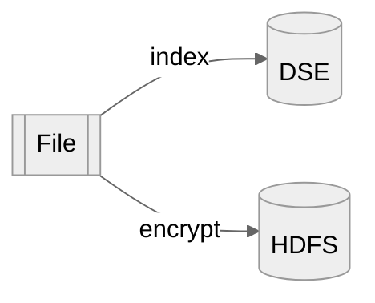
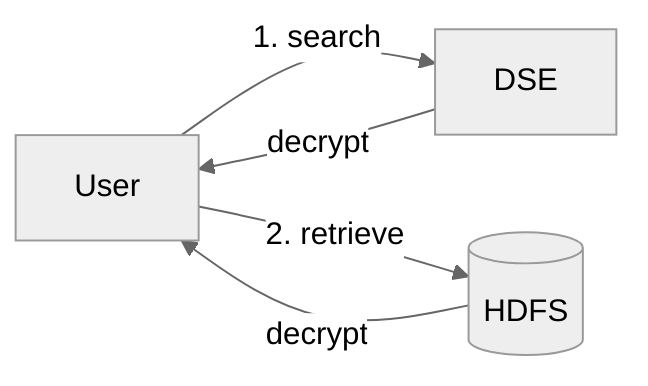

<h1>Cloudproof-java-demo</h1>

## Cloudproof encryption

Cloudproof provides encryption so that large repositories of data, and indexes 
 - can be safely stored encrypted with embedded policy attributes in the cloud then
 - quickly and confidentially searched using encrypted indexes and queries
 
Users can only decrypt data from partitions matching the access policy of their keys.

At no time does the cloud learn anything about the data stored, the indexes content, the queries to the indexes or the responses to the queries.

See the [documentation](https://docs.cosmian.com/cloudproof_encryption/use_cases_benefits/) for benefits, uses cases and technology details.

This demo shows: 

 - encrypted indexing and encryption of records to a Hadoop Distributed File System (HDFS) using a public key and policy attributes.
 - encrypted search and decryption of authorized transaction from HDFS using a private key that holds an access policy.

Encrypted indexes are stored in a cloud-type key-value store, Cassandra DSE in this demo.


<!-- @import "[TOC]" {cmd="toc" depthFrom=1 depthTo=6 orderedList=false} -->

<!-- code_chunk_output -->

- [Cloudproof encryption](#cloudproof-encryption)
- [Flow Overview](#flow-overview)
    - [Indexing using Symmetric Searchable Encryption](#indexing-using-symmetric-searchable-encryption)
    - [Attributes Based Encryption](#attributes-based-encryption)
- [Policy](#policy)
- [User Keys](#user-keys)
- [Software](#software)
  - [Example Usage](#example-usage)
    - [Encrypting](#encrypting)
    - [Searching](#searching)
    - [Direct Decryption](#direct-decryption)
  - [Building](#building)
  - [main program: cloudproof-demo](#main-program-cloudproof-demo)
  - [abe-gpsw](#abe-gpsw)
    - [Building abe-gpsw for a different glibc](#building-abe-gpsw-for-a-different-glibc)
  - [cosmian_java_lib](#cosmian_java_lib)
  - [Setting up a test hadoop environment](#setting-up-a-test-hadoop-environment)
    - [Listing Hadoop files](#listing-hadoop-files)
  - [Setting up Cassandra DSE](#setting-up-cassandra-dse)
    - [Running locally](#running-locally)
  - [Building a zip of this demo](#building-a-zip-of-this-demo)

<!-- /code_chunk_output -->


## Flow Overview

Upserting


Searching



**input/output file**

```text
{"firstName": "Felix","lastName": "Caparelli","phone": "06 52 23 63 25","email": "orci@icloud.fr","country": "France","region": "Corsica","employeeNumber": "SPN82TTO0PP","security": "confidential"}
{"firstName": "Emerson","lastName": "Wilkins","phone": "01 01 31 41 37","email": "enim.diam@icloud.edu","country": "Spain","region": "Antofagasta","employeeNumber": "BYE60HQT6XG","security": "confidential"}
{"firstName": "Ocean","lastName": "Meyers","phone": "07 45 55 66 55","email": "ultrices.vivamus@aol.net","country": "Spain","region": "Podlaskie","employeeNumber": "SXK82FCR9EP","security": "confidential"}
{"firstName": "Kiara","lastName": "Harper","phone": "07 17 88 69 58","email": "vitae@outlook.com","country": "Germany","region": "Rajasthan","employeeNumber": "CWN36QTX2BN","security": "secret"}
{"firstName": "Joelle","lastName": "Becker","phone": "01 11 46 84 14","email": "felis.adipiscing@hotmail.org","country": "France","region": "İzmir","employeeNumber": "AFR04EPJ1YM","security": "secret"}
{"firstName": "Stacy","lastName": "Reyes","phone": "03 53 66 40 67","email": "risus.a@yahoo.ca","country": "France","region": "Nord-Pas-de-Calais","employeeNumber": "ZVW02EAM3ZC","security": "secret"}

```

#### Indexing using Symmetric Searchable Encryption

Five indexes are created on the following patterns:

 - firstName
 - lastName
 - "first="+firstName
 - "last="+lastName
 - "country="+country

All values are converted to lower case before indexing

Values are indexed in a DSE Cassandra database 5.1.20. Everything is encrypted in the DB.

A search for "Douglas" will retrieve all the Douglas, first name or last name

A search for "first=Douglas" will only retrieve the Douglas used as a first name

#### Attributes Based Encryption

 - Enc: encryption with an ABE public key and policy attributes determined from the content of the transaction.
Each transaction/line is considered unique and becomes a file in HDFS with name `Base58(SHA-256(content))`

 - Dec: decryption with an user private key of authorised records collected in a clear text file. The access policy of the key determines which records can be decrypted.

## Policy

Two non hierarchical axes:

- `country`: `{ France, Germany, Spain }`
- `department`: `{ marketing, HR, security }`

The `country` axis partitions the rows of the database (on the value of the `country` value), while the `department` axis partitions the columns.

The `firstName`, `lastName` and `country` columns are visible for any user with a valid key.

The `region` column is only visible to a user who has a `department::marketing` attribute in its key access policy.

The `email`, `phone`, `employeeNumber` columns are only visible to a user who has a `department::HR` attribute in its key access policy.

The `security` column is only visible to the super admin.


## User Keys

User Decryption Keys with various access policies have been pre-generated in `src/test/resources/keys/`

Key                          | Access Policy
-----------------------------|---------------------------------------------------------
user_Alice_key.json          | `country::France & department::marketing`
user_Bob_key.json            | `country::Spain & department::HR`
user_Charlie_key.json        | `country::France & department::HR`
user_SuperAdmin_key.json     | `country::* & department::*`
user_Mallory_key.json        | `country::Other & department::other`


Access policies are boolean expressions of the form:
```
(department::marketing | department::HR) & (country::France | country::Spain)`
```

When policy attributes of a record make the expression `true`, the record can be decrypted.

## Software

The program comes in 2 flavors:

 - as a java standalone executable
 - and as a Spark program

It performs 

 - injection with encryption to HDFS and indexing to Cassandra 
  - and secure querying to Cassandra extraction with decryption from HDFS.

Fot instructions on how to build the software, see the [building](#building) section at the end.

Four sub-commands:
 - `--encrypt`: encryption and injection
 - `--search` : search words, extract and decrypt
 - `--decrypt`: direct extraction and decryption
 - `--generate-keys`: generate the keys above (requires KMS)


```
>java -jar target/cloudproof-demo-2.0.0.jar 
Jun 09, 2022 10:30:19 AM com.cosmian.cloudproof_demo.App main
INFO: Stating standalone app with args: []
usage: usage: app SUB-COMMAND [OPTIONS] [SOURCE URI] [WORD1, WORD2,...]
 -c,--clear-text-filename <arg>   the name of the clear text file when
                                  running decryption. Defaults to
                                  clear.txt
 -d,--decrypt                     decrypt the supplied files and
                                  directories URI(s)
 -dc,--dse-datacenter <arg>       the datacenter of the DSE server.
                                  Defaults to NULL or dc1 if the IP is
                                  127.0.0.1
 -di,--dse-ip <arg>               the IP address of the DSE server.
                                  Defaults to 127.0.0.1
 -dk,--dse-keyspace <arg>         the keyspace to use for the tables.
                                  Defaults to cosmian_sse
 -dp,--dse-port <arg>             the port of the DSE server. Defaults to
                                  9042
 -du,--dse-username <arg>         the username to connect to the DSE
                                  server. Defaults to NULL
 -dup,--dse-password <arg>        the password to connect to the DSE
                                  server. Defaults to NULL
 -e,--encrypt                     encrypt the supplied files and
                                  directories URI(s)
 -g,--generate-keys               generate all the keys
 -k,--key <arg>                   the path to the key file: defaults to
                                  key.json
 -o,--output-dir <arg>            the path of the output directory.
                                  Defaults to '.' for the filesystem,
                                  /user/${user} for HDFS
 -or,--disjunction                run a disjunction (OR) between the
                                  search words. Defaults to conjunction
                                  (AND)
 -s,--search                      search the supplied root URI for the
                                  words
```

### Example Usage

This shows examples using the Hadoop test environment set-up below

To use the spark version, simply replace `java -jar target/cloudproof-demo-2.0.0.jar` with `./spark-run.sh` in any example below

Replace the `hdfs:` scheme with `hdfsk:` in the URIs below if you wish to use 
the HDFS connector with kerberos authentication (the 2.7.5 hadoop docker below does NOT use Kerberos)

#### Encrypting

Encrypt 101 records read from `.src/test/resources/users.txt` and write the 100 files to HDFS at `"hdfs://root@localhost:9000/user/root/"`

- standalone

    ```bash
    time java -jar target/cloudproof-demo-2.0.0.jar --encrypt \
        -k src/test/resources/keys/public_key.json \
        -o "hdfs://root@localhost:9000/user/root/" \
        src/test/resources/users.txt
    ```

- spark

    ```bash
    time ./spark-run.sh --encrypt \
        -k src/test/resources/keys/public_key.json \
        -o "hdfs://root@localhost:9000/user/root/" \
        src/test/resources/users.txt
    ```

#### Searching

Alice can read the Marketing part (the region) of all users in France

 - standalone

    ```bash
    time java -jar target/cloudproof-demo-2.0.0.jar --search \
        -k src/test/resources/keys/user_Alice_key.json \
        -o src/test/resources/dec/ \
        -c search_results.txt \
        "hdfs://root@localhost:9000/user/root/" \
        "country=France"
    ```

 - spark

    ```bash
    time ./spark-run.sh --search \
        -k src/test/resources/keys/user_Alice_key.json \
        -o src/test/resources/dec/ \
        -c search_results.txt \
        "hdfs://root@localhost:9000/user/root/" \
        "country=France"
    ```


```
{"firstName":"Skyler","lastName":"Richmond","country":"France","region":"Chiapas"}
{"firstName":"MacKensie","lastName":"Atkinson","country":"France","region":"Sachsen"}
{"firstName":"Felix","lastName":"Robert","country":"France","region":"Aquitaine"}
{"firstName":"Wylie","lastName":"Snider","country":"France","region":"Kansas"}
... 
(31 total)
```


... but no user outside of France

```bash
time java -jar target/cloudproof-demo-2.0.0.jar --search \
    -k src/test/resources/keys/user_Alice_key.json \
    -o src/test/resources/dec/ \
    -c search_results.txt \
    "hdfs://root@localhost:9000/user/root/" \
    "country=Spain"
```

Bob can read the email, phone and employee number part of all users in Spain, but not their marketing part (the region)

```bash
time java -jar target/cloudproof-demo-2.0.0.jar --search \
    -k src/test/resources/keys/user_Bob_key.json \
    -o src/test/resources/dec/ \
    -c search_results.txt \
    "hdfs://root@localhost:9000/user/root/" \
    "country=Spain"
```

```
{"firstName":"Gavin","lastName":"Bailey","country":"Spain","phone":"08 25 25 31 93","email":"dui.in.sodales@protonmail.net","employeeNumber":"NVH67DKP6FV"}
{"firstName":"Jerry","lastName":"Gonzales","country":"Spain","phone":"07 24 80 13 06","email":"convallis.convallis@aol.org","employeeNumber":"RBU57EWQ8MI"}
{"firstName":"Wang","lastName":"Chan","country":"Spain","phone":"07 13 38 17 82","email":"venenatis.vel@outlook.net","employeeNumber":"VYY77VOW0QR"}
{"firstName":"Felix","lastName":"Garcia","country":"Spain","phone":"08 26 78 84 71","email":"pede.sagittis@aol.es","employeeNumber":"EQN94VSX2IJ"}
...
...
```


As expected the Super Admin can find users in all countries and view all details


```bash
time java -jar target/cloudproof-demo-2.0.0.jar --search \
    -k src/test/resources/keys/user_SuperAdmin_key.json \
    -o src/test/resources/dec/ \
    -c search_results.txt \
    "hdfs://root@localhost:9000/user/root/" \
    "Douglas"
```

... returns 3 records with first name **or** last name being "Douglas"

```
{"firstName":"Kalia","lastName":"Douglas","country":"France","security":"top_secret","phone":"03 56 82 77 04","region":"Tripura","email":"mus.proin@hotmail.net","employeeNumber":"AHM27UPN3HD"}
{"firstName":"Xander","lastName":"Douglas","country":"France","security":"top_secret","phone":"08 22 77 36 03","region":"Ile de France","email":"arcu.sed@protonmail.couk","employeeNumber":"DIY45MVM4TV"}
{"firstName":"Douglas","lastName":"Jones","country":"Spain","security":"confidential","phone":"02 91 58 51 74","region":"Kahramanmaraş","email":"djones@yahoo.com","employeeNumber":"JCO88AVA2LH"}

```

By default, search implements a conjunction (AND) when searching multiple words:


```bash
time java -jar target/cloudproof-demo-2.0.0.jar --search \
    -k src/test/resources/keys/user_SuperAdmin_key.json \
    -o src/test/resources/dec/ \
    -c search_results.txt \
    "hdfs://root@localhost:9000/user/root/" \
    "last=Douglas" "country=France"
```

... returns 2 records

```
{"firstName":"Kalia","lastName":"Douglas","country":"France","security":"top_secret","phone":"03 56 82 77 04","region":"Tripura","email":"mus.proin@hotmail.net","employeeNumber":"AHM27UPN3HD"}
{"firstName":"Xander","lastName":"Douglas","country":"France","security":"top_secret","phone":"08 22 77 36 03","region":"Ile de France","email":"arcu.sed@protonmail.couk","employeeNumber":"DIY45MVM4TV"}
```

... while ...

```bash
time java -jar target/cloudproof-demo-2.0.0.jar --search \
    -k src/test/resources/keys/user_SuperAdmin_key.json \
    -o src/test/resources/dec/ \
    -c search_results.txt \
    "hdfs://root@localhost:9000/user/root/" \
    "last=Douglas" "country=Spain"
```

... does not return any record

It is also possible to run a disjunction (OR) by specifying the `--or` option

```bash
time java -jar target/cloudproof-demo-2.0.0.jar --search --or \
    -k src/test/resources/keys/user_SuperAdmin_key.json \
    -o src/test/resources/dec/ \
    -c search_results.txt \
    "hdfs://root@localhost:9000/user/root/" \
    "first=Douglas" "last=Douglas"
```

...returns 3 records

```
{"firstName":"Douglas","lastName":"Jones","country":"Spain","security":"confidential","phone":"02 91 58 51 74","region":"Kahramanmaraş","email":"djones@yahoo.com","employeeNumber":"JCO88AVA2LH"}
{"firstName":"Xander","lastName":"Douglas","country":"France","security":"top_secret","phone":"08 22 77 36 03","region":"Ile de France","email":"arcu.sed@protonmail.couk","employeeNumber":"DIY45MVM4TV"}
{"firstName":"Kalia","lastName":"Douglas","country":"France","security":"top_secret","phone":"03 56 82 77 04","region":"Tripura","email":"mus.proin@hotmail.net","employeeNumber":"AHM27UPN3HD"}
```

#### Direct Decryption

It is also possible to attempt to directly decrypt all records (i.e. without doing a search)

```bash
time java -jar target/cloudproof-demo-2.0.0.jar --decrypt \
    -k src/test/resources/keys/user_Alice_key.json \
    -o src/test/resources/dec/ \
    -c direct_Alice.txt \
    "hdfs://root@localhost:9000/user/root/"
```


### Building

First, clone this directory locally. A working version of the Java 8 compiler must be available.

The software is linked to 2 separate open-source libraries made by Cosmian. For maximum security and compatibility, these librairies should be built on the target system, however it should not be necessary to rebuild them to build and run this demo.

 - [abe_gpsw](https://github.com/Cosmian/abe_gpsw): a native library developed in Rust that implements the ABE+AES hybrid cryptography.

 - [cosmian_java_lib](https://github.com/Cosmian/cosmian_java_lib): the main Cosmian Java Library that exposes the Cosmian APIs and calls the ABE native library


### main program: cloudproof-demo

1. Compile and package the program. From the root directory

    ```
    mvn clean package -Dmaven.test.skip
    ```

2. Pull the dependencies locally in `target/dependency` directory

    ```
    mvn dependency:copy-dependencies
    ```

3. Print the help to check everything is fine

    ```
    java -jar target/cloudproof-demo-2.0.0.jar
    ```


### abe-gpsw

A pre-built linux version of the abe_gpsw library is already available in the `src/main/resources/linux-x86-64` folder. However:

 - this version is built against GLIBC 2.34 which may not be the version on your system
 - this library is holding the cryptographic primitives: from a security standpoint, you should not trust the binary and build yourself from sources

1. Install a recent rust compiler using rustup: [Instructions](https://rustup.rs/)
2. Clone the abe_gpsw repository:
    ```
    git clone https://github.com/Cosmian/abe_gpsw.git
    ```
3. Checkout the version v0.6.5
    ```
    git checkout v0.6.5
    ```

4. Inside the abe_gpsw project directory, build the library unassigned
    ```
    cargo build --release --all-features
    ```
5. Copy the dynamic library in `target/release` subdirectory (called `libabe_gpsw.so` on Linux) to this `cloudproof-demo` project

    - `src/main/resources/linux-x86-64` folder for a Linux Intel machine
    - `src/main/resources/linux-amd64` folder for a Linux AMD machine
    - `src/main/resources/darwin` folder for a Mac running MacOS
    - `src/main/resources/win32-x86` folder for a Windows machine (untested)

#### Building abe-gpsw for a different glibc

Step 1. 2. and 3. are identical as above

4. Pull a distribution with the appropriate glibc (here targeting 2.17)

    ```sh
    sudo docker pull centos:centos7.4.1708
    ```


5. Execute the shell, mounting the current directory to `/root/abe_gpsw` inside the docker

    ```sh
    sudo docker run -it --rm -v $(pwd):/root/abe_gpsw centos:centos7.4.1708 /bin/bash
    ```

6. Inside the docker container, install rustup

    ```sh
    curl --proto '=https' --tlsv1.2 -sSf https://sh.rustup.rs | sh
    ```

7. Set the rust environment variables

    ```sh
    source $HOME/.cargo/env
    ```

8. Install missing build tools

    You may be missing linkers, etc... for centOs

    ```sh
    yum groupinstall "Development Tools"
    ```

    for Ubuntu

    ```sh
    sudo apt install build-essential
    ```

9. Build the library

    ```sh
    cd /root/abe_gpsw/
    cargo build --release --all-features --target-dir target_2_17
    ```

The library binary is available in `target_2_17/release/libabe_gpsw.so` 
and should be placed in `src/main/resources/linux-x86-64` of this project

### cosmian_java_lib

The cosmian java lib is available on Maven Central and does not need to be build to run this project.
If for security reasons, you still wish to do so,follow the steps below:

1. Clone the cosmian_java_lib repository:
    ```
    git clone https://github.com/Cosmian/cosmian_java_lib.git
    ```

2. Checkout the version v0.6.3
    ```
    git checkout v0.6.3
    ```
3. In the root directory of the cosmian_java_lib project, build the jar:
    ```
    mvn package -Dmaven.test.skip
    ```
4. Deploy the jar in the local Maven repository

    ```
    mvn install -Dmaven.test.skip
    ```


### Setting up a test hadoop environment

This uses a docker version of hadoop 2.7.5 and makes it available to the `root` user at:

 - root fs: `hdfs://root@localhost:9000/user/root`
 - admin console: http://localhost:8088

1. Create a `hadoop-2.7.5` directory and the following sub-directories

```bash
mkdir shared
mkdir logs
mkdir input
```

2. Start hadoop running the following command in th `hadoop-2.7.5` directory

```bash
docker run --name hadoop-2.7.5 \
-v $(pwd)/shared:/usr/local/hadoop/shared \
-v $(pwd)/logs:/usr/local/hadoop/logs \
-v hadoop-2.7.5-data:/usr/local/hadoop/data \
-v $(pwd)/input:/usr/local/hadoop/input \
-p 8088:8088 \
-p 8042:8042 \
-p 9000:9000 \
--rm \
zejnils/hadoop-docker
```

3. To stop hadoop, run

```bash
docker stop hadoop-2.7.5
```

#### Listing Hadoop files

Run the command inside the docker container:

```bash
sudo docker exec hadoop-2.7.5 /bin/bash -c "/usr/local/hadoop-2.7.5/bin/hadoop fs -ls"
```

... to count them ....
```bash
sudo docker exec hadoop-2.7.5 /bin/bash -c "/usr/local/hadoop-2.7.5/bin/hadoop fs -count ."
```

### Setting up Cassandra DSE

- version 5.1.20:  `docker pull datastax/dse-server:5.1.20`
- driver: https://docs.datastax.com/en/developer/java-driver/4.13/

#### Running locally

```bash
sudo docker run -e DS_LICENSE=accept --network host --name dse_5.1.20 -d datastax/dse-server:5.1.20
```

### Building a zip of this demo

To build a zip, clean up the target folder, re-build following the instructions above then zip without .git files

```sh
rm -rf target
mvn dependency:copy-dependencies
mvn package
cd ..
zip -r cloudproof-demo-1.0.0.zip  cloudproof-demo -x cloudproof-demo/.git/\*
```
