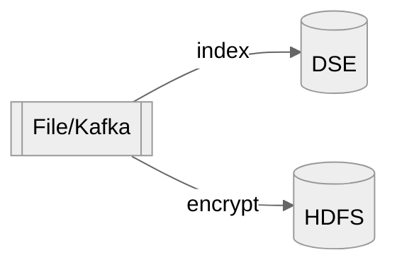
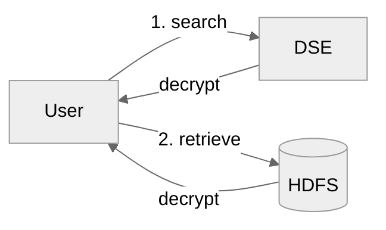
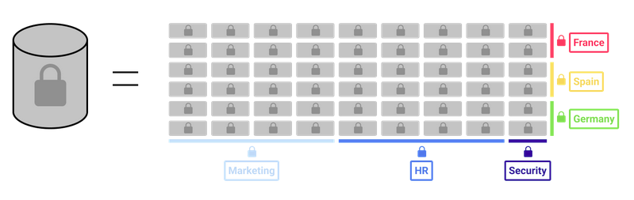

<h1>Cloudproof for Big Data</h1>

This repository provides a complete working big data application to encrypt and securely index a big data repository, 
then perform secure searches and decryption using 

This application shows: 

 - fetching data
    - directly from a file using a standalone Java app or Spark
    - from a Kafka topic
 - encrypted indexing and encrypting records with attributes using [Cloudproof cryptographic primitives](#cloudproof-encryption)
 - writing the encrypted records to files hosted in a Hadoop Distributed File System (HDFS)
 - encrypted search and decryption of authorized transaction from HDFS using private keys that hold various access policies, using either a the standalone java program or Spark.

The encrypted indexes are stored in a cloud-type key-value store, Cassandra DSE in this demo.


<!-- @import "[TOC]" {cmd="toc" depthFrom=1 depthTo=6 orderedList=false} -->

<!-- code_chunk_output -->

- [Flow Overview](#flow-overview)
- [Cloudproof encryption](#cloudproof-encryption)
- [Running the application](#running-the-application)
- [Customizing the application](#customizing-the-application)
- [Example data: encrypting a large people directory](#example-data-encrypting-a-large-people-directory)
  - [Input/output data](#inputoutput-data)
  - [Indexing using Symmetric Searchable Encryption](#indexing-using-symmetric-searchable-encryption)
  - [Encrypting the data with labels](#encrypting-the-data-with-labels)
  - [Policy](#policy)
  - [User Keys](#user-keys)
- [Software](#software)
  - [Example Usage](#example-usage)
    - [Encrypting](#encrypting)
    - [Searching](#searching)
    - [Direct Decryption](#direct-decryption)
  - [Building](#building)
  - [main program: cloudproof-demo](#main-program-cloudproof-demo)
  - [CoverCrypt](#covercrypt)
  - [cosmian_java_lib](#cosmian_java_lib)
- [Setting-up a test environment](#setting-up-a-test-environment)
  - [Spark 2.4.8 Hadoop 2.7](#spark-248-hadoop-27)
  - [Kafka 2.7](#kafka-27)
  - [Cassandra DSE 5.1.20 and Hadoop HDFS 2.7.5](#cassandra-dse-5120-and-hadoop-hdfs-275)
  - [Listing Hadoop files](#listing-hadoop-files)
  - [Creating a Kafka topic and testing it](#creating-a-kafka-topic-and-testing-it)
  - [Building a zip of this demo](#building-a-zip-of-this-demo)

<!-- /code_chunk_output -->


## Flow Overview

Upserting


Searching



## Cloudproof encryption

Cloudproof provides encryption so that large repositories of data, and indexes 
 - can be safely stored encrypted with embedded policy attributes in the cloud then
 - quickly and confidentially searched using encrypted indexes and queries
 
Users can only decrypt data from partitions matching the access policy of their keys.

At no time does the cloud learn anything about the data stored, the indexes content, the queries to the indexes or the responses to the queries.

See the [documentation](https://docs.cosmian.com/cloudproof_encryption/use_cases_benefits/) for benefits, uses cases and technology details.


## Running the application

1. Git clone this repository.

2. [Set up a test environment](#setup-a-test-environment) using the provided docker-compose file.
The default configurations are provided in the repository.

3. Maven must be installed. To build the application, run 
```
mvn package -Dmaven.test.skip @@ \
mvn dependency:copy-dependencies
```

4. Then run the [Examples](#example-usage) below


## Customizing the application

To customize the format of the files processed, the values indexed and the attributes used to encrypt
the files, modify the injector in  [Injector.java](src/main/java/com/cosmian/cloudproof_demo/injector/RecordInjector.java)

The injection is coded in the [injector](src/main/java/com/cosmian/cloudproof_demo/injector) directory:
 - Standalone java process: [StandaloneInjector.java](src/main/java/com/cosmian/cloudproof_demo/injector/StandaloneInjector.java)
 - Spark: [SparkInjector.java](src/main/java/com/cosmian/cloudproof_demo/injector/SparkInjector.java)
 - Kafka: [KafkaLineReader.java](/home/bgrieder/projects/cloudproof-java-demo/src/main/java/com/cosmian/cloudproof_demo/injector/KafkaLineReader.java)


The extraction is coded in [extractor](src/main/java/com/cosmian/cloudproof_demo/extractor):
 - Standalone Java Process: [StandaloneExtractor.java](src/main/java/com/cosmian/cloudproof_demo/extractor/StandaloneExtractor.java)
 - Spark: [SparkExtractor.java](src/main/java/com/cosmian/cloudproof_demo/extractor/SparkExtractor.java)


## Example data: encrypting a large people directory


### Input/output data

```text
{"firstName": "Felix","lastName": "Caparelli","phone": "06 52 23 63 25","email": "orci@icloud.fr","country": "France","region": "Corsica","employeeNumber": "SPN82TTO0PP","security": "confidential"}
{"firstName": "Emerson","lastName": "Wilkins","phone": "01 01 31 41 37","email": "enim.diam@icloud.edu","country": "Spain","region": "Antofagasta","employeeNumber": "BYE60HQT6XG","security": "confidential"}
{"firstName": "Ocean","lastName": "Meyers","phone": "07 45 55 66 55","email": "ultrices.vivamus@aol.net","country": "Spain","region": "Podlaskie","employeeNumber": "SXK82FCR9EP","security": "confidential"}
{"firstName": "Kiara","lastName": "Harper","phone": "07 17 88 69 58","email": "vitae@outlook.com","country": "Germany","region": "Rajasthan","employeeNumber": "CWN36QTX2BN","security": "secret"}
{"firstName": "Joelle","lastName": "Becker","phone": "01 11 46 84 14","email": "felis.adipiscing@hotmail.org","country": "France","region": "İzmir","employeeNumber": "AFR04EPJ1YM","security": "secret"}
{"firstName": "Stacy","lastName": "Reyes","phone": "03 53 66 40 67","email": "risus.a@yahoo.ca","country": "France","region": "Nord-Pas-de-Calais","employeeNumber": "ZVW02EAM3ZC","security": "secret"}

```

### Indexing using Symmetric Searchable Encryption

Five indexes are created on the following patterns:

 - firstName
 - lastName
 - "first="+firstName
 - "last="+lastName
 - "country="+country

All values are converted to lower case before indexing

Values are indexed in a DSE Cassandra database 5.1.20. Everything is encrypted in the DB.

A search for "Douglas" will retrieve all the Douglas, first name or last name

A search for "first=Douglas" will only retrieve the Douglas used as a first name

### Encrypting the data with labels

 - Enc: encryption with a CoverCrypt public key and policy attributes determined from the content of the record. (see below)

 - Dec: decryption with an user private key of authorised records collected in a clear text file. The access policy of the key determines which records can be decrypted.

### Policy

Two non hierarchical axes:

- `country`: `{ France, Germany, Spain }`
- `department`: `{ marketing, HR, security }`

The `country` axis partitions the rows of the database (on the value of the `country` value), while the `department` axis partitions the columns.

The `firstName`, `lastName` and `country` columns are visible for any user with a valid key.

The `region` column is only visible to a user who has a `department::marketing` attribute in its key access policy.

The `email`, `phone`, `employeeNumber` columns are only visible to a user who has a `department::HR` attribute in its key access policy.

The `security` column is only visible to the super admin.





### User Keys

User Decryption Keys with various access policies have been pre-generated in `src/test/resources/keys/`

Key                          | Access Policy
-----------------------------|---------------------------------------------------------
user_Alice_key.json          | `country::France & department::marketing`
user_Bob_key.json            | `country::Spain & department::HR`
user_Charlie_key.json        | `country::France & department::HR`
user_SuperAdmin_key.json     | `country::* & department::*`
user_Mallory_key.json        | `country::Other & department::other`


Access policies are boolean expressions of the form:
```
(department::marketing | department::HR) & (country::France | country::Spain)`
```

When policy attributes of a record make the expression `true`, the record can be decrypted.

## Software

The program comes in 2 flavors:

 - as a java standalone executable
 - and as a Spark program

It performs 

 - injection with encryption to HDFS and indexing to Cassandra 
  - and secure querying to Cassandra extraction with decryption from HDFS.

Fot instructions on how to build the software, see the [building](#building) section at the end.

Four sub-commands:
 - `--encrypt`: encryption and injection
 - `--search` : search words, extract and decrypt
 - `--decrypt`: direct extraction and decryption
 - `--generate-keys`: generate the keys above (requires KMS)
 - `--load-topic`: load data to a kafka topic


```
❯ java -jar target/cloudproof-demo-3.0.0.jar 
Jul 11, 2022 7:17:33 AM com.cosmian.cloudproof_demo.App main
INFO: Stating standalone app with args: []
usage: usage: app SUB-COMMAND [OPTIONS] [SOURCE URI] [WORD1, WORD2,...]
 -c,--clear-text-filename <arg>   the name of the clear text file when
                                  running decryption. Defaults to
                                  clear.txt
 -d,--decrypt                     decrypt the supplied files and
                                  directories URI(s)
 -dc,--dse-datacenter <arg>       the datacenter of the DSE server.
                                  Defaults to NULL or dc1 if the IP is
                                  127.0.0.1
 -di,--dse-ip <arg>               the IP address of the DSE server.
                                  Defaults to 127.0.0.1
 -dk,--dse-keyspace <arg>         the keyspace to use for the tables.
                                  Defaults to cosmian_sse
 -dp,--dse-port <arg>             the port of the DSE server. Defaults to
                                  9042
 -du,--dse-username <arg>         the username to connect to the DSE
                                  server. Defaults to NULL
 -dup,--dse-password <arg>        the password to connect to the DSE
                                  server. Defaults to NULL
 -e,--encrypt                     encrypt the supplied files and
                                  directories URI(s)
 -g,--generate-keys               generate all the keys
 -k,--key <arg>                   the path to the key file: defaults to
                                  key.json
 -kt,--kafka                      when encrypting the list of passed input
                                  are kafka topics
 -l,--load-topic                  load a kafka topic with data
 -ma,--max-age <arg>              the maximum age in seconds of an
                                  encrypted file before it rolls over to a
                                  new file. Defaults to MAX_INT (2 147 483
                                  647)
 -ms,--max-size <arg>             the maximum size in mega bytes of an
                                  encrypted file before it rolls over to a
                                  new file. Defaults to MAX_INT (2 147 483
                                  647)
 -o,--output-dir <arg>            the path of the output directory.
                                  Defaults to '.' for the filesystem,
                                  /user/${user} for HDFS
 -or,--disjunction                run a disjunction (OR) between the
                                  search words. Defaults to conjunction
                                  (AND)
 -s,--search                      search the supplied root URI for the
                                  words
 -zi,--drop-indexes               drop the indexes before running the
                                  injector (i.e. --encrypt)
```

### Example Usage

This shows examples using the Hadoop test environment set-up below

To use the spark version, simply replace `java -jar target/cloudproof-demo-3.0.0.jar` with `./spark-run.sh` in any example below

Replace the `hdfs:` scheme with `hdfsk:` in the URIs below if you wish to use 
the HDFS connector with kerberos authentication (the 2.7.5 hadoop docker below does NOT use Kerberos)

#### Encrypting

Encrypt 101 records read from `.src/test/resources/users.txt` and write the 100 files to HDFS at `"hdfs://root@localhost:9000/user/root/"`

- standalone from files

    ```bash
    time java -jar target/cloudproof-demo-3.0.0.jar --encrypt \
        -k src/test/resources/keys/public_key.json \
        -o "hdfs://root@localhost:9000/user/root/" \
        src/test/resources/users.txt
    ```

-  standalone from kafka topic(s)

    ```bash
    java -jar target/cloudproof-demo-3.0.0.jar --encrypt \
        -k src/test/resources/keys/public_key.json \
        -o "hdfs://root@localhost:9000/user/root/" \
        --kafka cloudproof-demo
    ```    

    When using Kafka, 
    
    1. the injector will look for a `kafka.properties` file in the current directory to configure the Kafka consumer.
    
    2. the injector will keep listening to the topic(s) until a line/record with the exact content `%END%` is received. 
    The injector will then exit and print the benchmarks.

    3. to load data to the kafka topic, use
    ```bash
    java -jar target/cloudproof-demo-3.0.0.jar --load-topic src/test/resources/users.txt
    ```
    4. to send `%END%` to the topic, see [Indexing using Symmetric Searchable Encryption](#creating-a-kafka-topic-and-testing-it)

- spark

    ```bash
    time ./spark-run.sh --encrypt \
        -k src/test/resources/keys/public_key.json \
        -o "hdfs://root@localhost:9000/user/root/" \
        src/test/resources/users.txt
    ```

#### Searching

Alice can read the Marketing part (the region) of all users in France

 - standalone

    ```bash
    time java -jar target/cloudproof-demo-3.0.0.jar --search \
        -k src/test/resources/keys/user_Alice_key.json \
        -o src/test/resources/dec/ \
        -c search_results.txt \
        "hdfs://root@localhost:9000/user/root/" \
        "country=France"
    ```

 - spark

    ```bash
    time ./spark-run.sh --search \
        -k src/test/resources/keys/user_Alice_key.json \
        -o src/test/resources/dec/ \
        -c search_results.txt \
        "hdfs://root@localhost:9000/user/root/" \
        "country=France"
    ```


```
{"firstName":"Skyler","lastName":"Richmond","country":"France","region":"Chiapas"}
{"firstName":"MacKensie","lastName":"Atkinson","country":"France","region":"Sachsen"}
{"firstName":"Felix","lastName":"Robert","country":"France","region":"Aquitaine"}
{"firstName":"Wylie","lastName":"Snider","country":"France","region":"Kansas"}
... 
(31 total)
```


... but no user outside of France

```bash
time java -jar target/cloudproof-demo-3.0.0.jar --search \
    -k src/test/resources/keys/user_Alice_key.json \
    -o src/test/resources/dec/ \
    -c search_results.txt \
    "hdfs://root@localhost:9000/user/root/" \
    "country=Spain"
```

Bob can read the email, phone and employee number part of all users in Spain, but not their marketing part (the region)

```bash
time java -jar target/cloudproof-demo-3.0.0.jar --search \
    -k src/test/resources/keys/user_Bob_key.json \
    -o src/test/resources/dec/ \
    -c search_results.txt \
    "hdfs://root@localhost:9000/user/root/" \
    "country=Spain"
```

```
{"firstName":"Gavin","lastName":"Bailey","country":"Spain","phone":"08 25 25 31 93","email":"dui.in.sodales@protonmail.net","employeeNumber":"NVH67DKP6FV"}
{"firstName":"Jerry","lastName":"Gonzales","country":"Spain","phone":"07 24 80 13 06","email":"convallis.convallis@aol.org","employeeNumber":"RBU57EWQ8MI"}
{"firstName":"Wang","lastName":"Chan","country":"Spain","phone":"07 13 38 17 82","email":"venenatis.vel@outlook.net","employeeNumber":"VYY77VOW0QR"}
{"firstName":"Felix","lastName":"Garcia","country":"Spain","phone":"08 26 78 84 71","email":"pede.sagittis@aol.es","employeeNumber":"EQN94VSX2IJ"}
...
...
```


As expected the Super Admin can find users in all countries and view all details


```bash
time java -jar target/cloudproof-demo-3.0.0.jar --search \
    -k src/test/resources/keys/user_SuperAdmin_key.json \
    -o src/test/resources/dec/ \
    -c search_results.txt \
    "hdfs://root@localhost:9000/user/root/" \
    "Douglas"
```

... returns 3 records with first name **or** last name being "Douglas"

```
{"firstName":"Kalia","lastName":"Douglas","country":"France","security":"top_secret","phone":"03 56 82 77 04","region":"Tripura","email":"mus.proin@hotmail.net","employeeNumber":"AHM27UPN3HD"}
{"firstName":"Xander","lastName":"Douglas","country":"France","security":"top_secret","phone":"08 22 77 36 03","region":"Ile de France","email":"arcu.sed@protonmail.couk","employeeNumber":"DIY45MVM4TV"}
{"firstName":"Douglas","lastName":"Jones","country":"Spain","security":"confidential","phone":"02 91 58 51 74","region":"Kahramanmaraş","email":"djones@yahoo.com","employeeNumber":"JCO88AVA2LH"}

```

By default, search implements a conjunction (AND) when searching multiple words:


```bash
time java -jar target/cloudproof-demo-3.0.0.jar --search \
    -k src/test/resources/keys/user_SuperAdmin_key.json \
    -o src/test/resources/dec/ \
    -c search_results.txt \
    "hdfs://root@localhost:9000/user/root/" \
    "last=Douglas" "country=France"
```

... returns 2 records

```
{"firstName":"Kalia","lastName":"Douglas","country":"France","security":"top_secret","phone":"03 56 82 77 04","region":"Tripura","email":"mus.proin@hotmail.net","employeeNumber":"AHM27UPN3HD"}
{"firstName":"Xander","lastName":"Douglas","country":"France","security":"top_secret","phone":"08 22 77 36 03","region":"Ile de France","email":"arcu.sed@protonmail.couk","employeeNumber":"DIY45MVM4TV"}
```

... while ...

```bash
time java -jar target/cloudproof-demo-3.0.0.jar --search \
    -k src/test/resources/keys/user_SuperAdmin_key.json \
    -o src/test/resources/dec/ \
    -c search_results.txt \
    "hdfs://root@localhost:9000/user/root/" \
    "last=Douglas" "country=Spain"
```

... does not return any record

It is also possible to run a disjunction (OR) by specifying the `--or` option

```bash
time java -jar target/cloudproof-demo-3.0.0.jar --search --or \
    -k src/test/resources/keys/user_SuperAdmin_key.json \
    -o src/test/resources/dec/ \
    -c search_results.txt \
    "hdfs://root@localhost:9000/user/root/" \
    "first=Douglas" "last=Douglas"
```

...returns 3 records

```
{"firstName":"Douglas","lastName":"Jones","country":"Spain","security":"confidential","phone":"02 91 58 51 74","region":"Kahramanmaraş","email":"djones@yahoo.com","employeeNumber":"JCO88AVA2LH"}
{"firstName":"Xander","lastName":"Douglas","country":"France","security":"top_secret","phone":"08 22 77 36 03","region":"Ile de France","email":"arcu.sed@protonmail.couk","employeeNumber":"DIY45MVM4TV"}
{"firstName":"Kalia","lastName":"Douglas","country":"France","security":"top_secret","phone":"03 56 82 77 04","region":"Tripura","email":"mus.proin@hotmail.net","employeeNumber":"AHM27UPN3HD"}
```

#### Direct Decryption

It is also possible to attempt to directly decrypt all records (i.e. without doing a search)

```bash
time java -jar target/cloudproof-demo-3.0.0.jar --decrypt \
    -k src/test/resources/keys/user_Alice_key.json \
    -o src/test/resources/dec/ \
    -c direct_Alice.txt \
    "hdfs://root@localhost:9000/user/root/"
```


### Building

First, clone this directory locally. A working version of the Java 8 compiler must be available.

The software is linked to 2 separate open-source libraries made by Cosmian. For maximum security and compatibility, these librairies should be built on the target system, however it should not be necessary to rebuild them to build and run this demo.

 - [abe_gpsw](https://github.com/Cosmian/abe_gpsw): a native library developed in Rust that implements the ABE+AES hybrid cryptography.

 - [cosmian_java_lib](https://github.com/Cosmian/cosmian_java_lib): the main Cosmian Java Library that exposes the Cosmian APIs and calls the ABE native library


### main program: cloudproof-demo

1. Compile and package the program. From the root directory

    ```
    mvn clean package -Dmaven.test.skip
    ```

2. Pull the dependencies locally in `target/dependency` directory

    ```
    mvn dependency:copy-dependencies
    ```

3. Print the help to check everything is fine

    ```
    java -jar target/cloudproof-demo-3.0.0.jar
    ```


### CoverCrypt

Pre-built linux versions of the cover_crypt library is already available in the `src/main/resources/linux-x86-64` and `src/main/resources/darwin-x86-64` folder. However:

 - this linux version is built against GLIBC 2.17 which may not be compatible with your system
 - this library is holding the cryptographic primitives: from a security standpoint, you should not trust the binary and build yourself from sources

### cosmian_java_lib

The cosmian java lib is available on Maven Central and does not need to be build to run this project.
If for security reasons, you still wish to do so,follow the steps below:

1. Clone the cosmian_java_lib repository:
    ```
    git clone https://github.com/Cosmian/cosmian_java_lib.git
    ```

2. Checkout the version v0.7.5
    ```
    git checkout v0.7.5
    ```
3. In the root directory of the cosmian_java_lib project, build the jar:
    ```
    mvn package -Dmaven.test.skip
    ```
4. Deploy the jar in the local Maven repository

    ```
    mvn install -Dmaven.test.skip
    ```

## Setting-up a test environment

### Spark 2.4.8 Hadoop 2.7

Download [Spark 2.4.8 Hadoop 2.7](https://archive.apache.org/dist/spark/spark-2.4.8/spark-2.4.8-bin-hadoop2.7.tgz)
and install it ina folder. 

Set the environment variable `SPARK_HOME` to the folder path.

### Kafka 2.7

Download Kafka 2.7.2 from https://archive.apache.org/dist/kafka/2.7.2/kafka_2.12-2.7.2.tgz and extract it

### Cassandra DSE 5.1.20 and Hadoop HDFS 2.7.5

Start the servers using the provided `docker-compose.yml` file i.e. in this directory, run

```sh
docker-compose up
```

### Listing Hadoop files

Use the provided helper script

```bash
./hdfs.sh -ls
```

... to count them ....
```bash
./hdfs.sh "-count ."
```

... and to delete them
```bash
./hdfs.sh "-rm -r /users/root/*"
```

### Creating a Kafka topic and testing it

In the `bin` directory of the Kafka install

```sh
./kafka-topics.sh --create --zookeeper localhost:2181 --replication-factor 1 --partitions 1 --topic cloudproof-demo
```

In a terminal window, create a producer:

```sh
./kafka-console-producer.sh --broker-list localhost:9092 --topic cloudproof-demo
```

... and in another window create a consumer...

```sh
./kafka-console-consumer.sh --bootstrap-server localhost:9092 --topic cloudproof-demo
```

... then type a message in the producer window, it should appear in the consumer window


### Building a zip of this demo

To build a zip, clean up the target folder, re-build following the instructions above then zip without .git files

```sh
rm -rf target
mvn dependency:copy-dependencies
mvn package
cd ..
zip -r cloudproof-demo-1.0.0.zip  cloudproof-demo -x cloudproof-demo/.git/\*
```
