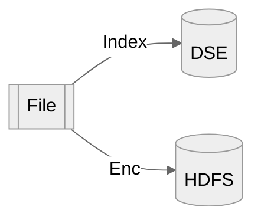
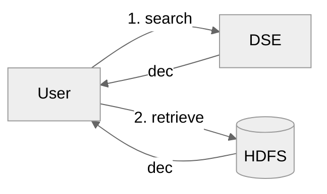

# Cloudproof-java-demo
## Key Policy Attribute Based Encryption (KP-ABE) and Symmetric Searchable Encryption (SSE)

Encryption of transactions to HDFS using a public key and access policy attributes.
Decryption of authorized transaction from HDFS using a private key with access policies.


  - [Key Policy Attribute Based Encryption (KP-ABE) and Symmetric Searchable Encryption (SSE)](#key-policy-attribute-based-encryption-kp-abe-and-symmetric-searchable-encryption-sse)
    - [Flow Overview](#flow-overview)
      - [Indexing using Symmetric Searchable Encryption](#indexing-using-symmetric-searchable-encryption)
      - [Attributes Based Encryption](#attributes-based-encryption)
    - [Policy](#policy)
    - [Policy Attributes](#policy-attributes)
    - [User Keys](#user-keys)
  - [Software](#software)
    - [Example Usage](#example-usage)
      - [Encrypting](#encrypting)
      - [Searching](#searching)
      - [Direct Decryption](#direct-decryption)
    - [Building](#building)
    - [abe-gpsw](#abe-gpsw)
    - [cosmian_java_lib](#cosmian_java_lib)
    - [main program: bnpp_cosmian](#main-program-bnpp_cosmian)
  - [Setting up a test hadoop environment](#setting-up-a-test-hadoop-environment)
    - [Listing Hadoop files](#listing-hadoop-files)
  - [Setting up Cassandra DSE](#setting-up-cassandra-dse)
    - [Running locally](#running-locally)


### Flow Overview

Upserting


Searching



**input/output file**

```text
{"payload":{"paymentFlowChainReferences":{"exc...
{"payload":{"paymentFlowChainReferences":{"exc...
{"payload":{"paymentFlowChainReferences":{"exc...
...
{"payload":{"paymentFlowChainReferences":{"exc...
{"payload":{"paymentFlowChainReferences":{"exc...

```

#### Indexing using Symmetric Searchable Encryption

 - Indexing direction value from `payload.businessPaymentInformation.pmtBizCntxt.drctn.ITRId`, can be `IN` or `OUT`
 - Extract first 2 characters frm IBAN from, if direction is 
    - `IN`: `payload.businessPaymentInformation.cdtr.cdtrAcct`
    - `OUT`: `payload.businessPaymentInformation.dbtr.dbtrAcct`

Values are indexed in a DSE Cassandra database 5.1.20. Everything is encrypted in the DB.

Values `IN` and `OUT` do not clash with the IBAN first 2 characters, but if this were the case we could index `DIR=IN` and ` DIR=OUT` instead.

#### Attributes Based Encryption

 - Enc: encryption with an ABE public key and policy attributes determined from the content of the transaction.
  Each transaction/line is considered unique and becomes a file in HDFS with name `Base58(SHA-256(content))`
 - Dec: decryption with an user private key of authorised transactions collected in a clear text file. The access policy of the key determines which transactions can be decrypted.

### Policy

Two non hierarchical axes:

- `Entity`: `{ BCEF, BNPPF, CIB, CashMgt }`
- `Country`: `{ France, Germany, Italy, Hungary, Spain, Belgium }`

### Policy Attributes

Policy attributes are determined based on the first part of the content of the field `header.functional.currentEventProducer.processId`

```json
{
    "payload": {
        ...
    },
    "header": {
        "functional": {
            ...
            "currentEventProducer": {
                "processId": "EUDBD701/EUBD08",
                "processType": {
                    "OEId": "CurProgram"
                },
                "stageId": "DebitBooking"
            },
            ...
        ...
        }
    }

```

ProcessId  |  Attributes
-----------|--------------------------------
EUDBD101   | Entity::BNPPF, Country::France
EUDBD501   | Entity::BNPPF, Country::Italy
EUDBD601   | Entity::BCEF, Country::France
EUDBD701   | Entity::CIB, Country::Belgium
*          | Entity::CashMgt, Country::France


### User Keys

User Decryption Keys with various access policies have been pre-generated

Key                          | Access Policy
-----------------------------|---------------------------------------------------------
user_BCEF_FRANCE_key.json    | `Entity::BCEF & Country::France`
user_BNPPF_France_key.json   | `Entity::BNPPF & Country::France`
user_BNPPF_Italy_key.json    | `Entity::BNPPF & Country::Italy`
user_CIB_Belgium_key.json    | `Entity::CIB & Country::Belgium`
user_BNPPF_ALL_key.json      | `Entity::BNPF & Country::*`
user_ALL_France_key.json     | `Entity::* & Country::France`
user_ALL_ALL_key.json        | `Entity::* & Country::*`  *<- super user*


Access policies are boolean expressions of the form:
```
(Entity::BNPPF | Entity::BCEF) & (Country::France | Country::Italy)`
```

When policy attributes of a transaction make the expression `true`, the transaction can be decrypted.

## Software

Java standalone program that performs injection with encryption to HDFS and extraction with decryption from HDFS.

Fot instructions on how to build the software, see the build section at the end.

Three sub-commands:
 - `--encrypt`: encryption and injection
 - `--search` : search words, extract and decrypt
 - `--decrypt`: extraction and decryption
 - `--generate-keys`: generate the keys above (requires KMS)


```
❯ java -jar target/cloudproof-demo-1.0.0.jar
usage: usage: app SUB-COMMAND [OPTIONS] [SOURCE URI] [WORD1, WORD2,...]
 -c,--clear-text-filename <FILENAME>   the name of the clear text file
                                       when running decryption. Defaults
                                       to clear.txt
 -d,--decrypt                          decrypt the supplied files and
                                       directories URI(s)
 -dc,--dse-datacenter <DATACENTER>     the datacenter of the DSE server.
                                       Defaults to NULL or dc1 if the IP
                                       is 127.0.0.1
 -di,--dse-ip <IP>                     the IP address of the DSE server.
                                       Defaults to 127.0.0.1
 -dp,--dse-port <PORT>                 the port of the DSE server.
                                       Defaults to 9042
 -du,--dse-username <USERNAME>         the username to connect to the DSE
                                       server. Defaults to NULL
 -dup,--dse-password <PASSWORD>        the password to connect to the DSE
                                       server. Defaults to NULL
 -e,--encrypt                          encrypt the supplied files and
                                       directories URI(s)
 -g,--generate-keys                    generate all the keys
 -k,--key <FILE>                       the path to the key file: defaults
                                       to key.json
 -o,--output-dir <URI>                 the path of the output directory.
                                       Defaults to '.' for the filesystem,
                                       /user/${user} for HDFS
 -s,--search                           search the supplied root URI for
                                       the words
```

### Example Usage

This shows example using the Hadoop test environment set-up below

Replace the `hdfs:` scheme with `hdfso:` in the URIs below if you wish to use 
the HDFS connector without kerberos authentication (for example when using the 2.7.5 hadoop docker below)

#### Encrypting

Encrypt 1408 records read from `.src/test/resources/pesddcosmian.txt` and write the 100 files to HDFS at `"hdfs://root@localhost:9000/user/root/"`

```bash
java -jar target/cloudproof-demo-1.0.0.jar --encrypt \
    -k src/test/resources/keys/public_key.json \
    -o "hdfs://root@localhost:9000/user/root/" \
    src/test/resources/pesddcosmian.txt
```

#### Searching

All sample records have an OUT direction, so this will find them all in `"hdfs://root@localhost:9000/user/root/"` with the `ALL_ALL` super user key

```bash
java -jar target/cloudproof-demo-1.0.0.jar --search \
    -k src/test/resources/keys/user_ALL_ALL_key.json \
    -o src/test/resources/dec/ \
    -c search_OUT_ALL_ALL.txt \
    "hdfs://root@localhost:9000/user/root/" \
    "OUT"
```

There are 2 records for 'DE'....

```bash
java -jar target/cloudproof-demo-1.0.0.jar --search \
    -k src/test/resources/keys/user_ALL_ALL_key.json \
    -o src/test/resources/dec/ \
    -c search_DE_ALL_ALL.txt \
    "hdfs://root@localhost:9000/user/root/" \
    "DE"
```

.... but only one can be decrypted using the `BNPPF_France` key

```bash
java -jar target/cloudproof-demo-1.0.0.jar --search \
    -k src/test/resources/keys/user_BNPPF_France_key.json \
    -o src/test/resources/dec/ \
    -c search_DE_BNPPF_France.txt \
    "hdfs://root@localhost:9000/user/root/" \
    "DE"
```

The current strategy implements `OR` but ` ANDè (disjunction) could easily be implemented

```bash
java -jar target/cloudproof-demo-1.0.0.jar --search \
    -k src/test/resources/keys/user_ALL_ALL_key.json \
    -o src/test/resources/dec/ \
    -c search_DE_NL_ALL_ALL.txt \
    "hdfs://root@localhost:9000/user/root/" \
    "DE" "NL"
```


#### Direct Decryption

It is also possible to attempt to directly decrypt all records (i.e. without doing a search)

Decrypt records in `"hdfs://root@localhost:9000/user/root/"` with the BNPPF_France user key and create a file `src/test/resources/dec/BNPPF_France.txt`

```bash
java -jar target/cloudproof-demo-1.0.0.jar --decrypt \
    -k src/test/resources/keys/user_BNPPF_France_key.json \
    -o src/test/resources/dec/ \
    -c BNPPF_France.txt \
    "hdfs://root@localhost:9000/user/root/"
```

Decrypt records in `"hdfs://root@localhost:9000/user/root/"` with the BNPPF_ALL user key and create a file `src/test/resources/dec/BNPPF_ALL.txt`


```bash
java -jar target/cloudproof-demo-1.0.0.jar --decrypt \
    -k src/test/resources/keys/user_BNPPF_ALL_key.json \
    -o src/test/resources/dec/ \
    -c BNPPF_ALL.txt \
    "hdfs://root@localhost:9000/user/root/"
```

Decrypt records in `"hdfs://root@localhost:9000/user/root/"` with the ALL_ALL super user key and create a file `src/test/resources/dec/ALL_ALL.txt`


```bash
java -jar target/cloudproof-demo-1.0.0.jar --decrypt \
    -k src/test/resources/keys/user_ALL_ALL_key.json \
    -o src/test/resources/dec/ \
    -c ALL_ALL.txt \
    "hdfs://root@localhost:9000/user/root/"
```


### Building

First, clone this directory locally. A working version of the Java 8 compiler must be available.

The software is linked to 2 separate open-source libraries made by Cosmian. For maximum security and compatibility, these librairies should be built on the target system.

 - [abe_gpsw](https://github.com/Cosmian/abe_gpsw): a native library developed in Rust that implements the ABE+AES hybrid cryptography.

 - [cosmian_java_lib](https://github.com/Cosmian/cosmian_java_lib): the main Cosmian Java Library that exposes the Cosmian APIs and calls the ABE native library


### abe-gpsw

A pre-built linux version of the abe_gpsw library is already available in the `src/main/resources/linux-x86-64` folder. However:

 - this version is built against GLIBC 2.34 which may not be the version on your system
 - this library is holding the cryptographic primitives: from a security standpoint, you should not trust the binary and build yourself from sources

1. Install a recent rust compiler using rustup: [Instructions](https://rustup.rs/)
2. Clone the abe_gpsw repository:
    ```
    git clone https://github.com/Cosmian/abe_gpsw.git
    ```
3. Checkout the version v0.6.5
    ```
    git checkout v0.6.5
    ```

4. Inside the abe_gpsw project directory, build the library unassigned
    ```
    cargo build --release --all-features
    ```
5. Copy the dynamic library in `target/release` subdirectory (called `libabe_gpsw.so` on Linux) to this `bnpp_cosmian` project

    - `src/main/resources/linux-x86-64` folder for a Linux Intel machine
    - `src/main/resources/linux-amd64` folder for a Linux AMD machine
    - `src/main/resources/darwin` folder for a Mac running MacOS
    - `src/main/resources/win32-x86` folder for a Windows machine (untested)

#### Building abe-gpsw for a different glibc

Step 1. 2. and 3. are identical as above

4. Pull a distribution with the appropriate glibc (here targeting 2.17)

    ```sh
    sudo docker pull centos:centos7.4.1708
    ```


5. Execute the shell, mounting the current directory to `/root/abe_gpsw` inside the docker

    ```sh
    sudo docker run -it --rm -v $(pwd):/root/abe_gpsw centos:centos7.4.1708 /bin/bash
    ```

6. Inside the docker container, install rustup

    ```sh
    curl --proto '=https' --tlsv1.2 -sSf https://sh.rustup.rs | sh
    ```

7. Set the rust environment variables

    ```sh
    source $HOME/.cargo/env
    ```

8. Install missing build tools

    You may be missing linkers, etc... for centOs

    ```sh
    yum groupinstall "Development Tools"
    ```

    for Ubuntu

    ```sh
    sudo apt install build-essential
    ```

9. Build the library

    ```sh
    cd /root/abe_gpsw/
    cargo build --release --all-features --target-dir target_2_17
    ```

The library binary is available in `target_2_17/release/libabe_gpsw.so` 
and should be placed in `src/main/resources/linux-x86-64` of this project

### cosmian_java_lib

The cosmian java lib is available on Maven Central and does not need to be build to run this project.
If for security reasons, you still wish to do so,follow the steps below:

1. Clone the cosmian_java_lib repository:
    ```
    git clone https://github.com/Cosmian/cosmian_java_lib.git
    ```

2. Checkout the version v0.6.3
    ```
    git checkout v0.6.3
    ```
3. In the root directory of the cosmian_java_lib project, build the jar:
    ```
    mvn package -Dmaven.test.skip
    ```
4. Deploy the jar in the local Maven repository

    ```
    mvn install -Dmaven.test.skip
    ```

### main program: bnpp_cosmian

1. Compile and package the program. From the root directory

    ```
    mvn clean package -Dmaven.test.skip
    ```

2. Pull the dependencies locally in `target/dependency` directory

    ```
    mvn dependency:copy-dependencies
    ```

3. Print the help to check everything is fine

    ```
    java -jar target/cloudproof-demo-1.0.0.jar
    ```


## Setting up a test hadoop environment

This uses a docker version of hadoop 2.7.5 and makes it available to the `root` user at:

 - root fs: `hdfs://root@localhost:9000/user/root`
 - admin console: http://localhost:8088

1. Create a `hadoop-2.7.5` directory and the following sub-directories

```bash
mkdir shared
mkdir logs
mkdir input
```

2. Start hadoop running the following command in th `hadoop-2.7.5` directory

```bash
docker run --name hadoop-2.7.5 \
-v $(pwd)/shared:/usr/local/hadoop/shared \
-v $(pwd)/logs:/usr/local/hadoop/logs \
-v hadoop-2.7.5-data:/usr/local/hadoop/data \
-v $(pwd)/input:/usr/local/hadoop/input \
-p 8088:8088 \
-p 8042:8042 \
-p 9000:9000 \
--rm \
zejnils/hadoop-docker
```

3. To stop hadoop, run

```bash
docker stop hadoop-2.7.5
```

### Listing Hadoop files

Run the command inside the docker container:

```bash
sudo docker exec hadoop-2.7.5 /bin/bash -c "/usr/local/hadoop-2.7.5/bin/hadoop fs -ls"
```

... to count them ....
```bash
sudo docker exec hadoop-2.7.5 /bin/bash -c "/usr/local/hadoop-2.7.5/bin/hadoop fs -count ."
```

## Setting up Cassandra DSE

- version 5.1.20:  `docker pull datastax/dse-server:5.1.20`
- driver: https://docs.datastax.com/en/developer/java-driver/4.13/

### Running locally

```bash
sudo docker run -e DS_LICENSE=accept --network host --name dse_5.1.20 -d datastax/dse-server:5.1.20
```

## Deploying via zip

Clean up the target folder, re-build then zip without .git files

```sh
rm -rf target
mvn dependency:copy-dependencies
mvn package
cd ..
zip -r cloudproof-demo-1.0.0.zip  cloudproof-demo -x cloudproof-demo/.git/\*
```
